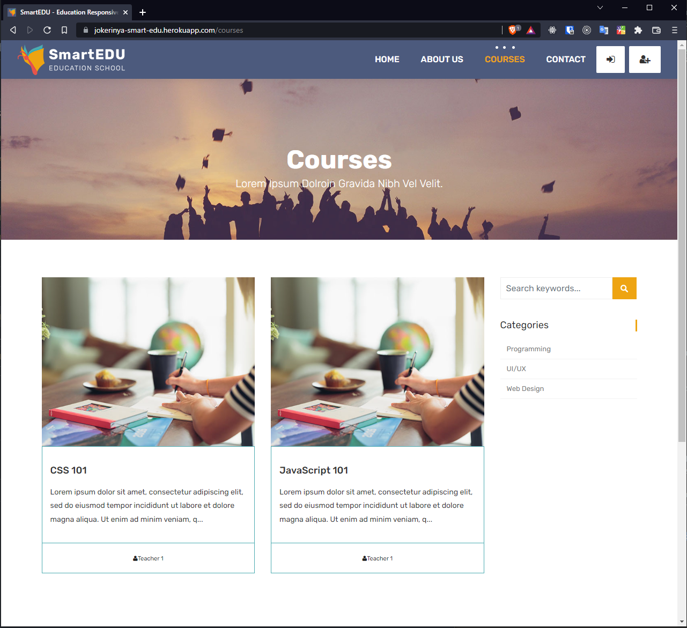

# SmartEdu

This is a self-learning small project that has been done with <a href="https://www.patika.dev/" target="_blank">patika.dev</a> `NodeJs` course.

👉This site is online at <a href="https://jokerinya-smart-edu.herokuapp.com/" target="_blank">here</a> (heroku platform). `MongoDB` have been used for DB.



For installing packages

```bash
npm install
```

and to start the server,

```bash
npm start
```

_Don't forget to add your credentials to `.env` file._

## In this course I learned _(for NodeJs enviroment)_,

- `express` framework,
- `nodemon` package usage,
- `ejs` template structure,
- `Middlewares` and `method-override` package,
- `MVC` structure,
- `Routing`,
- `Mongoose Model` structure,
- `dotenv` package and credential hiding,
- `Auth` and `Role` adding,
- `bcyrpt` package and password hashing,
- `slugify` package and URL slugifying,
- `connect-flash` package and flash messages,
- `nodemailer` package and automatic mail sending service,
- `express-validation` package and server-side request body validation,
- MongoDB atlas usage.

You can register to the application as a **student** or as a **teacher**. As a teacher you can do `CRUD` functinality for your own courses. As a student you can `Enroll` and `Relase` the courses. Also, **admin** user have all the `CRUD` functionality on the application.  
<br>
Of course not all of them has been showed in the course content. In addition to course content, **I added some extra specaialty to this small project.**

- All the uncessary pages that were in the template has been cleaned,
- `dotenv` package has been added for credentials,
- `recaptcha` feature has been added for mail sending feature for **_safety reasons_**
  <a href="https://jokerinya-smart-edu.herokuapp.com/contact" target="_blank">👉try it.</a>
